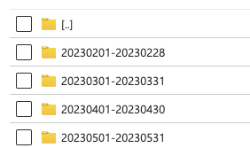
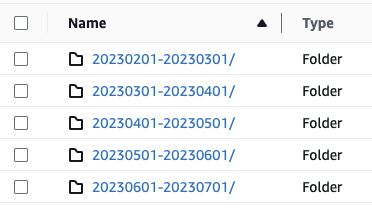

# Follow the instructions provided here to load the cost and usage reports generated by Azure and AWS
If you've not already generated the cost and usage reports, please follow the instructions provided in the [setup](../setup/) section. It takes a few hours for the reports to be generated after the initial setup.

Depending on the size of your account, the cost and usage reports can be quite large. The reports are generated in CSV format and can be downloaded from the respective cloud provider's portal. The reports are typically generated on a daily basis and are stored in a specific folder in the cloud provider's storage account. The reports are typically stored in a folder with the following naming convention:

- Azure: 

  
- AWS: 

    

**You can request Azure or AWS Support to give historical data for the cost and usage reports. It takes them just a few hours to drop the data in the storage location.**

## Table of contents
- [Database Setup](#Database-Setup)
- [Azure Setup](#Azure-Setup)
- [AWS Setup](#AWS-Setup)
- [Appendix](#Appendix)

## Database Setup
Choose the database of your choice to load the data. We recommend using ClickHouse. You can also use other databases like PostgreSQL, MySQL, or SQL Server.

    ### Install ClickHouse:
    The ClickHouse installation will prompt for the default password. Make sure to enter a strong password. 

    ```sh
    GNUPGHOME=$(mktemp -d) && sudo GNUPGHOME="$GNUPGHOME" gpg --no-default-keyring --keyring /usr/share/keyrings/clickhouse-keyring.gpg --keyserver hkp://keyserver.ubuntu.com:80 --recv-keys 8919F6BD2B48D754 && sudo rm -r "$GNUPGHOME" && sudo chmod +r /usr/share/keyrings/clickhouse-keyring.gpg && echo "deb [signed-by=/usr/share/keyrings/clickhouse-keyring.gpg] https://packages.clickhouse.com/deb stable main" | sudo tee /etc/apt/sources.list.d/clickhouse.list && sudo apt-get update && sudo apt-get install -y clickhouse-server clickhouse-client
    ```

    To enable ClickHouse in the startup & Verify the installation, run:

    ```sh
    sudo systemctl enable clickhouse-server && sudo service clickhouse-server restart && sudo service clickhouse-server status  
    ```

    ### Install postgresql:
    Install PostgreSQL and start the service:

    ```sh
    sudo apt-get install postgresql postgresql-contrib -y && sudo service postgresql start
    ```

    To enable PostgreSQL in the startup & Verify the installation, run:
    ```sh
    sudo systemctl enable postgresql && sudo service postgresql restart && sudo service postgresql status  
    ```

    Set a strong password for the PostgreSQL user 'postgres':
    ```shell
    sudo -u postgres psql
    ```

    Enter: `\password postgres`
    **Note**: Enter a new & strong password. Please make sure to copy it and update in the `.env` file. 

    Create the database "primeorbit" or give a name of your choice, using the same `psql` prompt:    

    Command: 
    ```sh
    CREATE DATABASE "primeorbit";

    `\l`    - to list the databases
    `\q`    - quit the psql promt
    ```

    ## Load the downloaded data into the database:

## Azure-Setup

1. **Download the cost and usage reports from the Azure portal**:
    - Navigate to the Azure portal and select the **Cost Management + Billing** option.
    - Select **Cost Analysis** from the left-hand menu.
    - Select **Download** from the top menu and select **Cost and Usage**.
    - Select the **Scope** and **Time Range** for which you want to download the report.
    - Click on **Download** to download the report.


2. **Load the data into the database**:
    - The downloaded report is in CSV format. You can use the following command to load the data into the database. Replace the `path_to_csv_file` with the actual path to the downloaded CSV file.

    ```sh
    clickhouse-client --query="INSERT INTO primeorbit.azure_cost_and_usage FORMAT CSV" < path_to_csv_file
    ```

    **Note**: The table name `azure_cost_and_usage` is the default table name. You can change the table name as per your requirement.

    **Note**: If you are using PostgreSQL, you can use the following command to load the data into the database. Replace the `path_to_csv_file` with the actual path to the downloaded CSV file.

    ```sh
    psql -U postgres -d primeorbit -c "\copy azure_cost_and_usage FROM 'path_to_csv_file' DELIMITER ',' CSV HEADER"
    ```

    **Note**: The table name `azure_cost_and_usage` is the default table name. You can change the table name as per your requirement.


## AWS-Setup

1. **Download the cost and usage reports from the AWS portal**:
    - Navigate to the AWS portal and select the **Billing and Cost Management** option.
    - Select **Cost and Usage Reports** from the left-hand menu.
    - Select the **Report Name** and **Time Range** for which you want to download the report.
    - Click on **Download** to download the report.

2. **Load the data into the database**:
    - The downloaded report is in CSV format. You can use the following command to load the data into the database. Replace the `path_to_csv_file` with the actual path to the downloaded CSV file.

    ```sh
    clickhouse-client --query="INSERT INTO primeorbit.aws_cost_and_usage FORMAT CSV" < path_to_csv_file
    ```

    **Note**: The table name `aws_cost_and_usage` is the default table name. You can change the table name as per your requirement.

    **Note**: If you are using PostgreSQL, you can use the following command to load the data into the database. Replace the `path_to_csv_file` with the actual path to the downloaded CSV file.

    ```sh
    psql -U postgres -d primeorbit -c "\copy aws_cost_and_usage FROM 'path_to_csv_file' DELIMITER ',' CSV HEADER"
    ```

    **Note**: The table name `aws_cost_and_usage` is the default table name. You can change the table name as per your requirement.


## Appendix
The instructions above are for loading the cost and usage reports into the database. You can use the same instructions to load the data into other databases like PostgreSQL, MySQL, or SQL Server. The commands may vary slightly based on the database you are using. Please refer to the documentation of the respective database for more details.