# AWS - Setup

There are two types of accounts in AWS:  
- Payer account: This is the account that pays the bill. The Cost and Usage Report will be created in the payer account. It will contain the Usage details of all it's linked accounts.  
- Payee or Linked or Sub accounts: These are the accounts that are linked to the payer account.  

    PrimeOrbit needs access both to the <u>Cost and Usage Report</u> in the payer account and also to the <u>metadata of the services</u> in all it's linked accounts.  

    ## Step-1: Setting up the account(s)

    - PAYER ACCOUNT - NEW COST AND USAGE REPORT AND USER ACCESS FOR SERVICES METADATA: If you're doing it for the first time, use this [CloudFormation script](./payer_account_full_setup.yml). It creates both the cost and usage report and then sets up AWS access with required policies.  

    - PAYER ACCOUNT - USER ACCESS FOR SERVICES METADATA: This option does not create the cost and usage report (CUR) but takes the input of the CUR Bucket to setup access on the bucket for the new user that will be created. It also creates the user, group, and adds necessary [policies](./policies.md) to query the services and its properties or metadata. Use this [CloudFormation script](./payer_account_access_only_setup.yml).  

    - LINKED ACCOUNT - USER ACCESS FOR SERVICES METADATA: It creates the user, group, and adds necessary [policies](./policies.md) to query the services and its properties or metadata. Use this [CloudFormation script](./linked_account_access_only_setup.yml). 

    - Alternatively, you can also follow the [manual steps](#fully-manual-option-if-you-dont-want-to-go-through-cloudformation) listed here to create the user access. This applies to both PAYER and LINKED accounts. 

    #### How to run the cloudformation StackSet script in all linked accounts at once
    
    - Go to the right REGION in your organization/payer account: 
    https://console.aws.amazon.com/cloudformation/home?region=us-east-1

    - [LINKED Account Access Only](./linked_account_access_only_setup.yml) script does not require any inputs. We will use this cloudformation in all the linked accounts  

    - Create a new stackset using the CloudFormation.  
        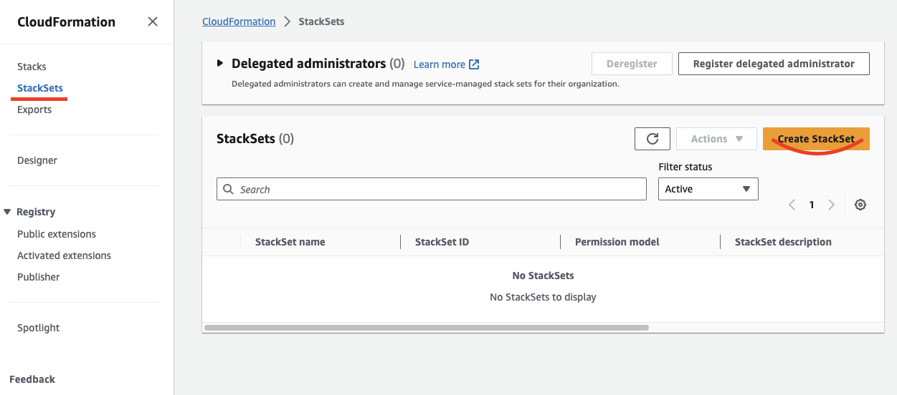  

    - Select the following options. Click on "Next" button.   
        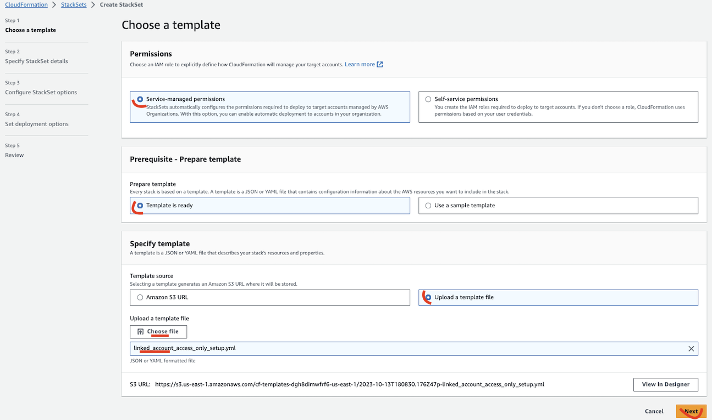

    - Provide the stackset name (Ex: primeorbit-stack-access) and a description.  
        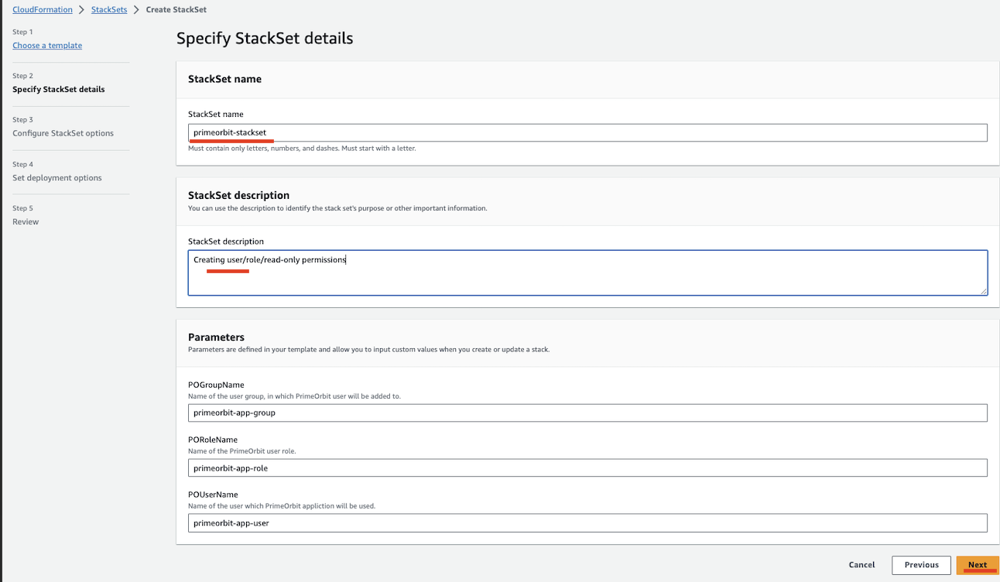            

    - Click on "Next" button a couple of times.  
    - Pick the OUs or "Deploy to organization".  
    - Pick the Region.
        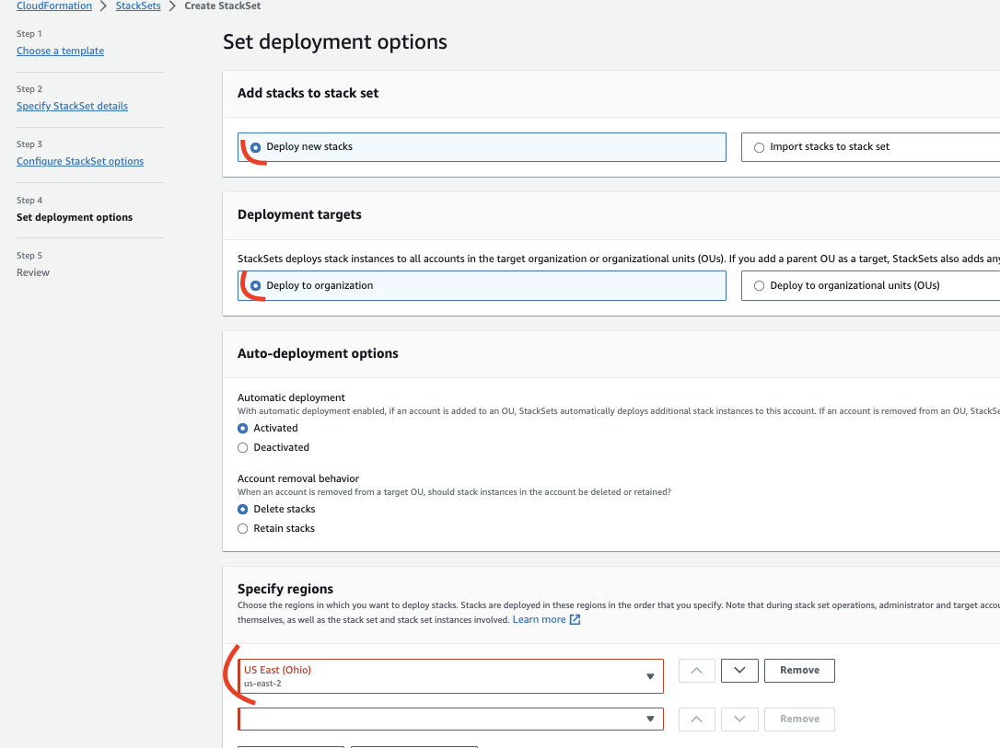
    - Click on "Next" button a couple of times, check "I acknowlege..." and finally "Submit"  
    - It takes a few minutes to create the stack in each of the accounts in the OU.  
    - The end result should like this:
        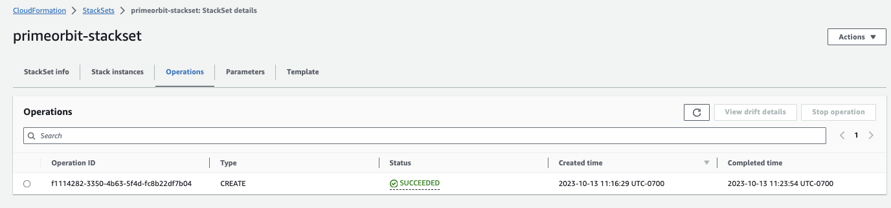
    - Go to [Step-2](#step-2-get-the-access-keys-to-share-it-with-primeorbit)  

    #### How to run the cloudformation script one account at a time
    
    - Go to the right REGION and the right ACCOUNT in: 
    https://console.aws.amazon.com/cloudformation/home?region=us-east-1

    - [PAYER Account Full Setup](./payer_account_full_setup.yml) script has all inputs as optional.  takes the S3 bucket as the input, creates the user/role and give read permissions to the policies listed below.  
    - [PAYER Account Access Only](./payer_account_access_only_setup.yml) script takes an cost and usage report bucket as input. Admin must enter the bucket name if it is different from the default.  
    - [LINKED Account Access Only](./linked_account_access_only_setup.yml) script does not require any inputs.  

    - Create a new stack using the CloudFormation script.  
        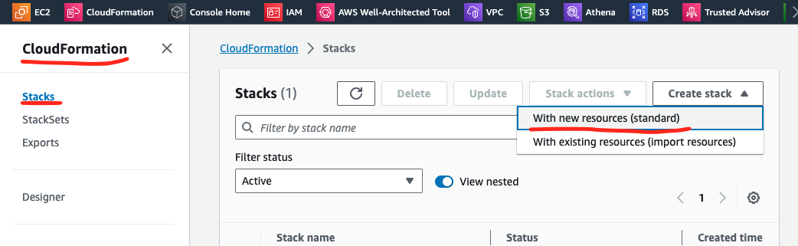  

    - Pick the right cloudformation file. Click on "Next" button.   
        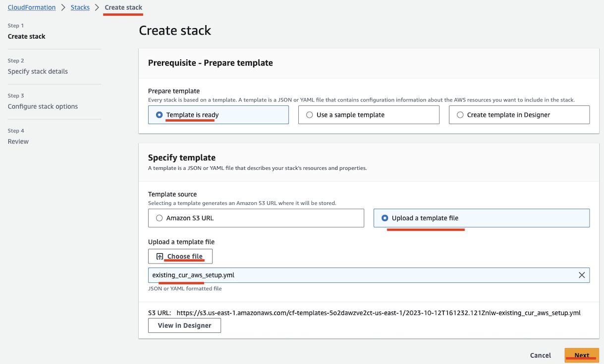

    - Provide the stack name (Ex: primeorbit-stack-access) and the S3 bucket name (default: curexports).  
        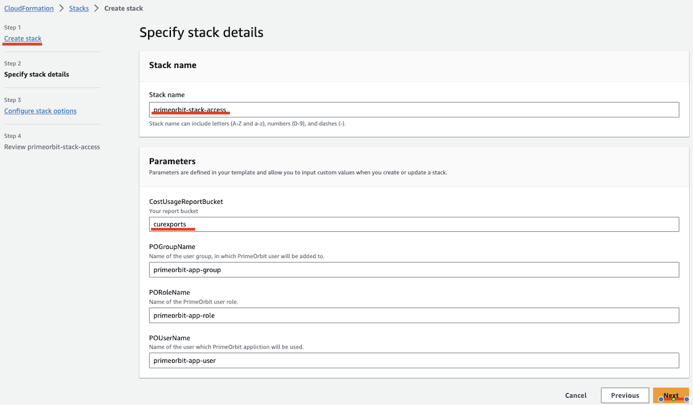

    - Click on "Next" button a couple of times, check "I acknowlege..." and finally "Submit"  
    - It takes a few minutes to create the stack.  
    - The end result should like this:
        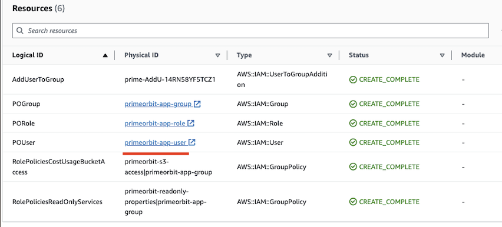
    - Go to [Step-2](#step-2-get-the-access-keys-to-share-it-with-primeorbit)  

    #### FULLY MANUAL OPTION: 
            
    ##### Steps to manually create the user/role and give read permissions to the policies listed below. 

    - Assumption: The Cost and Usage Report is already created.  
    - Create a new user/role with the following policies.  
    - In the attached policies, make sure the right S3 bucket is specified.  
    - Create a new policy with the following permissions shared [here](./policies.md).  
    - Attach the policy to the user/role.  

    ## STEP-2: Get the access keys to share it with PrimeOrbit. 
    - Open IAM console and click on the user you created in the previous step.
        
        Try this: https://us-east-1.console.aws.amazon.com/iamv2/home?region=us-east-1#/users/details/primeorbit-app-user?section=permissions

    - Click on the "Security credentials" tab.
    - Click on "Create access key" button.
        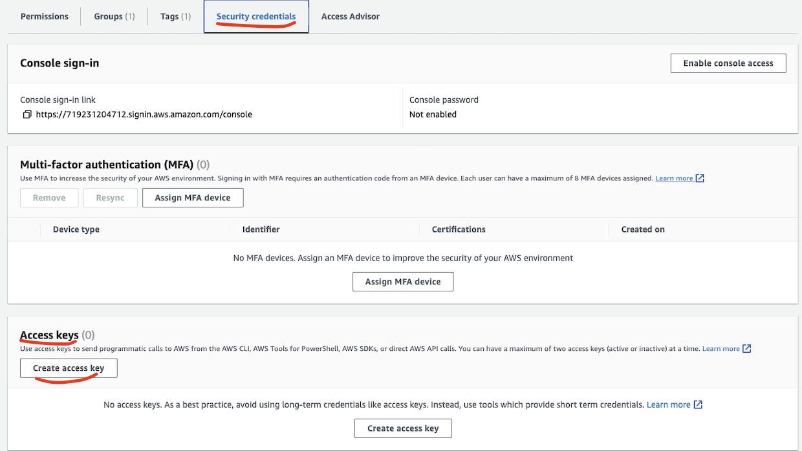
        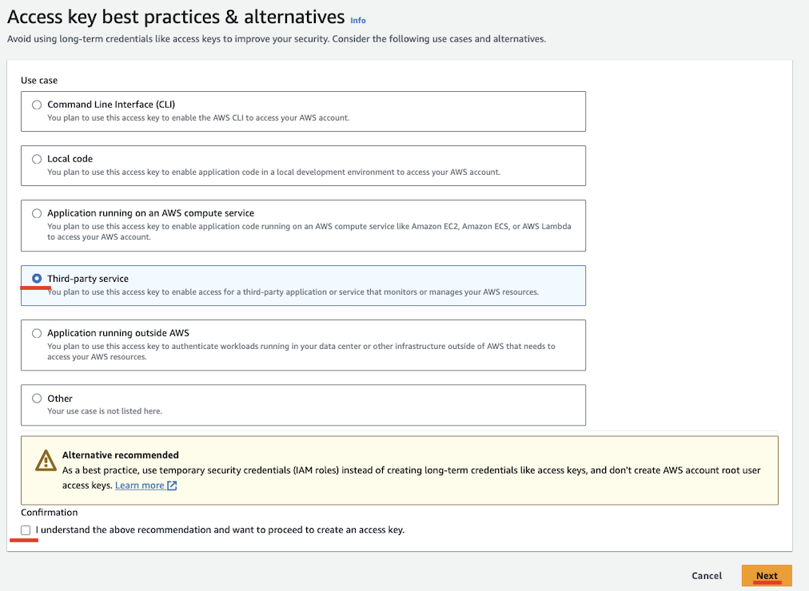
    - Specify a tag for the access key and/or click on "Create access key" button.
    - Click on "Show" button to see the access key and secret key.
    - Copy the access key and secret key and share it with PrimeOrbit.   
    
