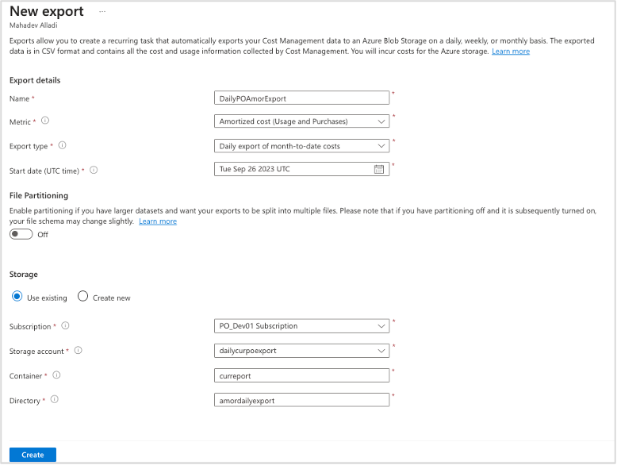

# Follow the instructions provided here to manually create cost and usage reports in Azure and AWS
The admin needs to perform a few steps to create the cost and usage report jobs. Alternatively, the administrator can also the cloudformation or bash scripts that have automated these steps.

## Table of contents

- [Azure Setup](#Azure-Setup)
- [AWS Setup](#AWS-Setup)
- [Appendix](#Appendix)

# Cost and Usage Reports

Cloud Providers, including Azure and AWS, offer cost and usage reports to help customers seeking granular information into their resource utilization and cost breakdowns. PrimeOrbit Cost Management solution utilizes these reports as a data source to offer enhanced insights into an organization's cloud costs.

This document provides detailed steps to setup Cost and Usage reports in Azure and AWS. Both Azure and AWS store these reports in the storage accounts or buckets from where users can download or pull the reports into external tools for further analysis. It is recommended that the storages are created prior to setting up the exports. The document will also cover this prerequisite step.

# Azure Setup

## 1.1 Create Storage Account

Below are the steps to create a storage account.

1. In Azure portal, click create button and then select **'Storage Account'** in the left navigation.
2. On the create page, fill in the required details in the **'Basics'** tab as described below.

    

1. For **Subscription,** select the subscription where you want to create the storage account.
2. For **Resource Group,** use an existing group from the drop down or create a new one for e.g., PO Cost.
3. For **Storage Account Name,** provide a name for the account that describes what the storage is used for e.g., dailycurpoexport.
4. For **Region,** select the preferred region
5. For **Performance,** select **Standard**
6. For **Redundancy,** select appropriate option based on your policies.

1. Click on **Review** button to make sure the remaining configurations are as per your organization's policies.
2. Click **Create** button.

## 1.2 Setup Cost and Usage Export

Azure provides two types of Cost and Usage report exports - 'Actual cost' and 'Amortized cost'. The Cost App requires both types to provide detailed insights and recommendations. The below sections detail the steps to set up both types of daily cost and usage exports.

### 1.2.1 Actual Cost and Usage Export

1. In Azure portal, search for **'Cost Management + Billing'** service, where the export can be setup.

    

1. In the Cost Management + Billing page's left-hand menu click on the **Billing Scope** and select the appropriate scope – ideally Organization's billing account so the export can include cost and usage data of all the subscriptions in the tenant.
2. In the left-hand menu, under Settings section click on **Exports**.

    

1. In the Exports page click  **Add**  and type a name for the export
2. For the  **Metric** , select **Actual cost (Usage and Purchases)** to export standard usage and purchases.
3. For  **Export type** , select **Daily export of month-to-date costs**  - Provides a new export file daily for your month-to-date costs. The latest data is aggregated from previous daily exports.
4. Specify the subscription for your Azure storage account that was created in section 2.1, then select a resource group or create a new one for e.g., PO Cost.
5. Select the storage account name (e.g., dailycurpoexport) that was created in section 2.1
6. Select the location (Azure region).
7. Specify the storage container (e.g., curreport) and the directory path (e.g., dailyexport) that you'd like the export file to go to.

    

1. Review export details and select  **Create**.

### 1.2.2 Amortized Cost and Usage Export
The amortized cost export setup process is similar to the Actual cost export setup process. The only difference is that 'Amortized cost' should be selected for the metric type. The detailed steps are outlined below:

1.	In the Exports page click Add and type a name for the export
2.	For the Metric, select Amortized cost (Usage and Purchases) to export standard usage and purchases.
3.	For Export type, select Daily export of month-to-date costs - Provides a new export file daily for your month-to-date costs. The latest data is aggregated from previous daily exports.
4.	Specify the subscription for your Azure storage account that was created in section 2.1, then select a resource group or create a new one for e.g., PO Cost.
5.	Select the storage account name (e.g., dailycurpoexport) that was created in section 2.1
6.	Select the location (Azure region).
7.	Specify the storage container (e.g., curreport) and the directory path (e.g., amordailyexport) that you'd like the export file to go to.
8.	Review export details and select Create.

See the below figure for reference.
     

# AWS Setup

We have automated AWS export setup using CloudFormation. This section details the steps to run the CloudFormation script.

We will use AWS's [CloudFormation](https://docs.aws.amazon.com/AWSCloudFormation/latest/UserGuide/Welcome.html)(CF) service to automate setting up the service. The CloudFormation module is declared in a YML (pronounced YAML) file that includes most of the steps required. Here are a few advantages:

1. All the newly created resources and settings are in one place that is easily viewable.
2. Easy rollback when issues are encountered. There are no remnants from a setup or deployment.
3. Versioning can be tracked too.

The pricing for CloudFormation for this set of operations is negligible. Additional pricing information is given [here](https://aws.amazon.com/cloudformation/pricing/). We will, however, closely track it.

If you prefer to setup the export manually, the process is detailed in the Appendix section.

## 2.1 Setup and run CloudFormation Script

For PO Cost App to efficiently access AWS cost and usage reports of all linked accounts, setup and run the CloudFormation script in **'Management Account'.**

1. In AWS management console, search for **'CloudFormation'** and click on it.

    

1. In CloudFormation-\>Stacks page, click on **Create stack** drop-down and choose the option With new resource

    

1. In Create Stack page, choose **Template is ready** check box under **Prerequisite – Prepare template** section and in **Specify template** section choose **Upload a template file** checkbox, and then click on Choose file box to upload the YAML formatted file.
    
    

1. Download the YAML file that was shared and upload it.
2. Click **Next**
3. In the **Specify stack details** page, provide **Stack name** e.g., **POCostDailyCur**. Rest of the parameters are auto populated. You can change them according to your preference and click **Next.**

    

1. Click **Next** in the step 2 page.
2. In Step 3 page, check the **acknowledge box** and click **Submit**

    
    

# Appendix

For PO Cost App to efficiently access AWS cost and usage reports of all linked accounts, setup the S3 bucket and CUR reports in **'Management Account'.**

## 3.1 Create S3 bucket

1. In AWS management console, search for **'S3'** and click on S3.

    

1. In S3 console page, click on **'Create bucket'** button in the Buckets section.

    

1. In the **'Create bucket**' page, provide the required information.

    

  1. For **Bucket name** , provide a name e.g., 'dailycurpoexport.'
  2. For **AWS Region,** select the preferred region.
  3. For **Object Ownership,** select **ACLs disabled (recommended)**
  4. For **Block Public Access settings for this bucket,** check **Block all public access.**

        

  1. For **Bucket Versioning,** check **Disable.**

        

  1. For **Tags,** add all relevant tags below are the example tags (see above figure).
    1. department = it
    2. team = it
    3. product = POCostApp
    4. env = prod
    5. Owner = Chris Satola

  2. For **Encryption type** and **Bucket Key,** check preferred options based on your organization's policies. Below figure describes example selections
  
        

  1. Review all the configurations and click on **Create bucket.**

## Setup Cost and Usage Report

In AWS, cost and usage reports can be setup in the Billing Service. Follow the below steps to setup the reports.

1. In **AWS management console** , search for **'Billing'** and select the service.

    

1. In AWS Billing's navigation pane, choose **Cost & usage Reports** and within the page choose **Create report.**

    

1. For **Report name** , enter a name e.g., **dailypocurreport.**

    

1. For **Report additional content** ,
  1. Select **Include resource IDs** to include the IDs of each individual resource in the report.
  2. Select  **Split cost allocation data**  to include detailed cost and usage for shared resources (Amazon ECS only).
2. For  **Data refresh settings** , select **Refresh automatically** and click **Next** button.

    

1. For  **S3 bucket** , choose  **Configure**.

    

1. In the  **Configure S3 bucket**  dialog box, **Select an existing bucket** so you can select the bucket created in section 3.1. The alternate option is to create a new bucket.
  1. Click on **Browse S3** button and select the bucket created in section 3.1 i.e., **dailycurpoexport**
  2. Review the bucket policy, select  **The following default policy will be applied to your bucket** , and then choose  **Save**.

        

1. For  **Report path prefix** , enter the report path prefix that will be prepended to the name of the report e.g., **dailycurreport**
2. For  **Report**  **Time granularity** , choose **Daily**
3. For  **Report versioning** , choose **Create new report version.**

    

1. For  **Report data integration** , leave all boxes (Amazon Athena, Amazon Redshift, or Amazon QuickSight) **unchecked.**
2. For **Compression type,** choose **GZIP**
3. Choose  **Next**.
4. After reviewing the settings in **Review and create** page, click **Create report** button.

    

-----------
For any questions, please reach out to alladi@primeorbit.com or prasad@primeorbit.com at any time.

